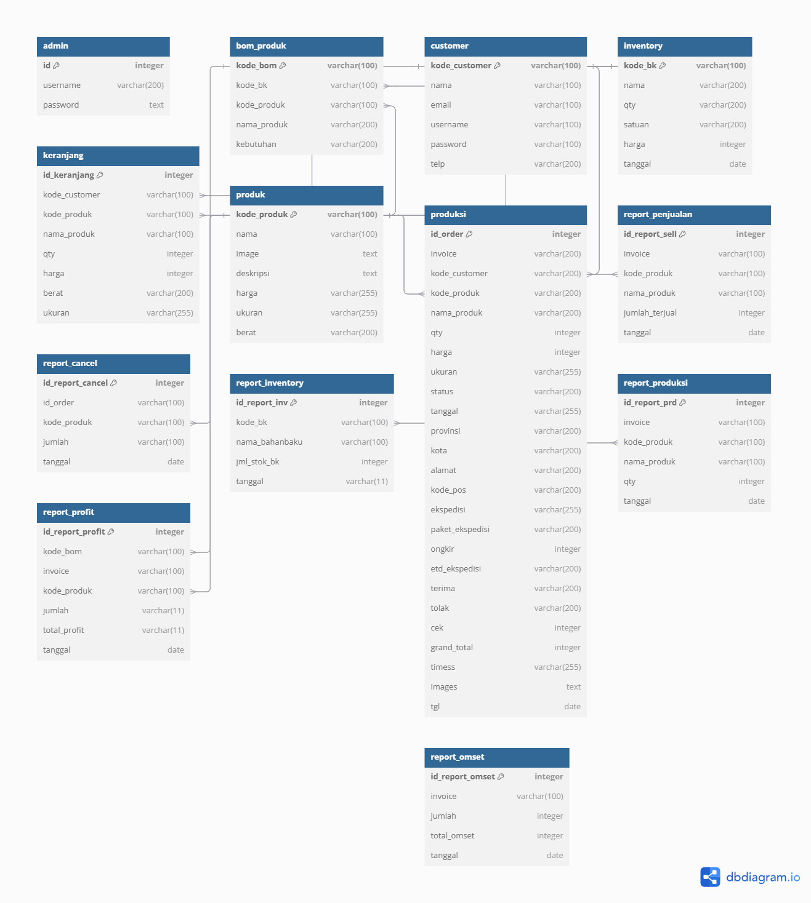
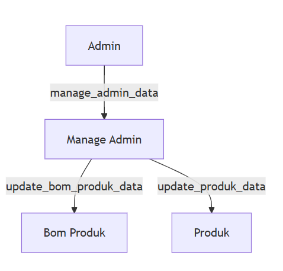
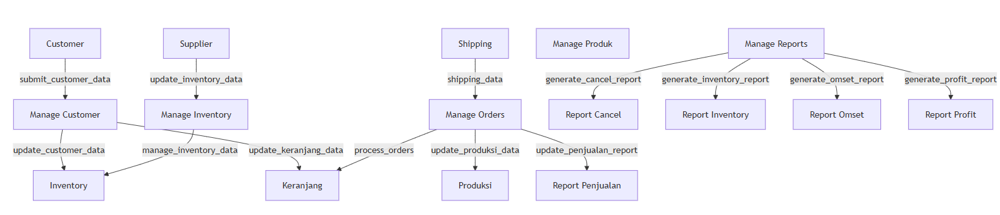
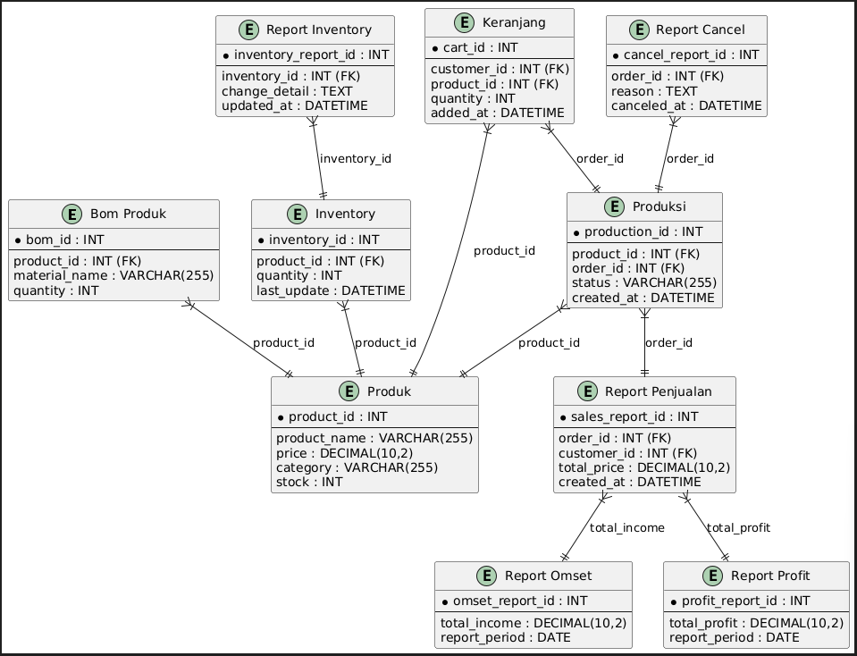
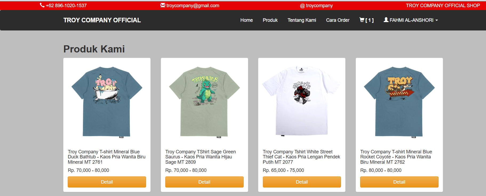
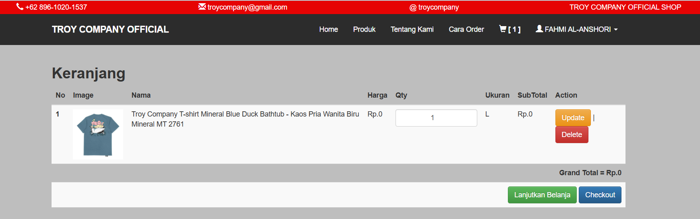
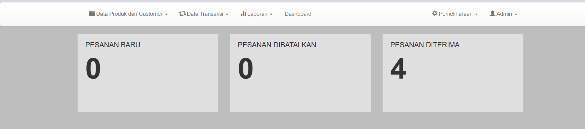
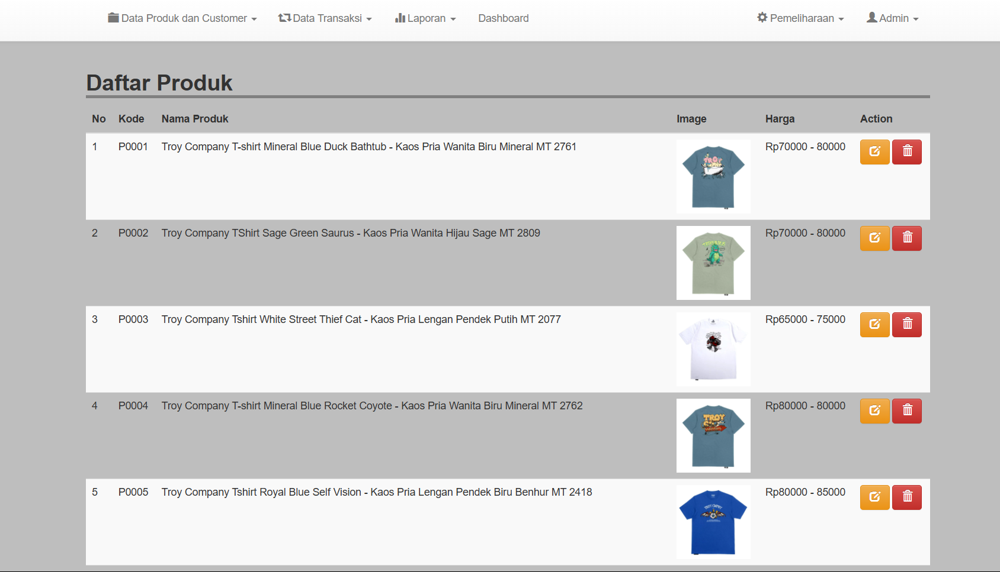

# Laporan Proyek Pengembangan Aplikasi Web Toko Online Kaos Distro Troy Company Shop


Penyusun :

Fahmi Al-Anshori / 225410090

Sidiq Imawan / 225410097

Muhammad Dafa Argara / 225410105


## Program Studi Informatika Kelas 1 Fakultas Teknologi Informasi Universitas Teknologi Digital Indonesia (UTDI) 2024

## 1. Pendahuluan

### A. Latar Belakang: 

Seiring dengan pesatnya perkembangan teknologi dan gaya hidup digital, masyarakat kini semakin cenderung berbelanja secara online, termasuk dalam hal pembelian pakaian dan produk distro. Hal ini menjadi tantangan bagi toko-toko pakaian konvensional yang perlu beradaptasi dengan kebutuhan pasar. Banyak pengusaha distro yang belum memanfaatkan platform online dengan optimal, padahal melalui platform tersebut, mereka dapat menjangkau lebih banyak konsumen dari berbagai daerah.

Troy Company Official Shop hadir untuk memenuhi kebutuhan tersebut dengan menyediakan platform belanja online untuk produk distro yang berkualitas. Website ini dirancang untuk memberikan pengalaman belanja yang mudah, cepat, dan aman bagi konsumen. Dengan konsep toko online, konsumen dapat dengan nyaman memilih produk sesuai dengan selera, melihat detail produk, serta melakukan transaksi secara online.


### B. Tujuan: 

Tujuan utama dari pengembangan website Troy Company Official Shop adalah untuk:

a. Menyediakan platform toko online yang mudah diakses oleh konsumen di Yogyakarta, khususnya bagi mereka yang tertarik dengan produk distro berkualitas.

b. Meningkatkan jangkauan pemasaran produk distro, memungkinkan toko untuk menjangkau konsumen dari luar kota Yogyakarta.

c. Menyediakan pengalaman belanja yang menyenangkan dengan fitur-fitur seperti katalog produk, sistem keranjang belanja, dan sistem pembayaran yang aman.

d. Mengoptimalkan transaksi online dan mempercepat proses pemesanan produk dengan adanya sistem checkout dan pengelolaan pesanan yang efisien.


### C. Batasan Masalah : 
Proyek ini dibatasi pada pengembangan website untuk penjualan produk pakaian distro dengan fitur-fitur dasar yang mendukung transaksi online. Beberapa batasan masalah yang ditetapkan dalam proyek ini adalah sebagai berikut:

#### 1. Fitur yang Akan Dikembangkan:

a. Halaman utama yang menampilkan produk-produk yang tersedia.

b. Sistem manajemen produk yang memungkinkan admin untuk menambahkan, mengedit, dan menghapus produk.

c. Sistem keranjang belanja dan checkout untuk memudahkan konsumen dalam berbelanja.

d. Sistem autentikasi pengguna untuk mengelola akun pelanggan.

e. Halaman pembayaran yang mendukung beberapa metode pembayaran seperti transfer bank dan e-wallet.

f. Tampilan responsif yang dapat diakses dengan baik di perangkat desktop maupun mobile.

#### 2. Fitur yang Tidak Akan Dikembangkan:

a. Fitur pengelolaan stok produk secara real-time.

b. Fitur pengiriman otomatis atau integrasi dengan kurir.

c. Pengelolaan sistem promo atau diskon yang rumit.

d. Fitur manajemen multi-admin atau multi-role.

## 2. Perancangan Sistem

### Rancangan Semula/Awal

#### Rancangan Database : 



#### Data flow diagram (DFD) level 0 : 





#### Realisasi

 

### 3. Teknologi 

Kelompok kami dalam pembuatan website toko kaos online TROY COMPANY tersebut menggunakan PHP NATIVE karena kami masih mengalami kekusahan dan eror pada saat mengaplikasikan ke dalam framework Laravel.

### 4. Implementasi

##### Tampilan user halaman produk.php

---

```php
<?php 
	include 'header.php';
 ?>

<!-- PRODUK TERBARU -->
<div class="container">
	<h2 ><b>Produk Kami</b></h2>

	<div class="row">
		<?php 
		$result = mysqli_query($conn, "SELECT * FROM produk GROUP BY kode_produk");
		while ($row = mysqli_fetch_assoc($result)) {
			?>
			<div class="col-sm-6 col-md-3">
				<div class="thumbnail">
					" >
					<div class="caption">
						<h5><?= $row['nama'];  ?></h5>
						<h5>
								<?php 
							if(strpos($row['harga'], ",") == false){
								echo "Rp. ".number_format($row['harga'])."";
							}else{
								$a = explode(",", $row['harga']);
								echo "Rp. ".number_format($a[0])." - ".number_format(end($a));  

							}
							 ?> 
						</h5>
						<div class="row">
							<div class="col-md-12">
								<a href="detail_produk.php?produk=<?= $row['kode_produk']; ?>" class="btn btn-warning btn-block">Detail</a> 
							</div>
				

						</div>

					</div>
				</div>
			</div>
			<?php 
		}
		?>
	</div>

</div>

 <?php 
	include 'footer.php';
 ?>
 
```


##### Tampilan user keranjang.php

---


```php
<?php 
include 'header.php';


if(isset($_POST['submit1'])){
	$id_keranjang = $_POST['id'];
	$qty = $_POST['qty'];

	$edit = mysqli_query($conn, "UPDATE keranjang SET qty = '$qty' where id_keranjang = '$id_keranjang'");
	if($edit){
			echo "
		<script>
		alert('KERANJANG BERHASIL DIPERBARUI');
		window.location = 'keranjang.php';
		</script>
		";
	}
}else if(isset($_GET['del'])){
	$id_keranjang = $_GET['id'];
	$del = mysqli_query($conn, "DELETE FROM keranjang WHERE id_keranjang = '$id_keranjang'");
	if($del){
		echo "
		<script>
		alert('1 PRODUK DIHAPUS');
		window.location = 'keranjang.php';
		</script>
		";
	}
}

?>


<div class="container" style="padding-bottom: 300px;">
	<h2><b>Keranjang</b></h2>
		<table class="table table-striped">
			<?php 
			if(isset($_SESSION['user'])){
				$kode_cs = $_SESSION['kd_cs'];
			// CEK JUMLAH KERANJANG
				$cek = mysqli_query($conn, "SELECT * FROM keranjang WHERE kode_customer = '$kode_cs'");
				$jml = mysqli_num_rows($cek);

				if($jml > 0){
					?>	
					<thead>
						<tr>
							<th scope="col">No</th>
							<th scope="col">Image</th>
							<th scope="col">Nama</th>
							<th scope="col">Harga</th>
							<th scope="col">Qty</th>
							<th scope="col">Ukuran</th>
							<th scope="col">SubTotal</th>
							<th scope="col">Action</th>
						</tr>
					</thead>
					<?php 
					if(isset($_SESSION['kd_cs'])){
						$kode_cs = $_SESSION['kd_cs'];


						$result = mysqli_query($conn, "SELECT k.id_keranjang as keranjang, k.kode_produk as kd, k.nama_produk as nama, k.qty as jml, p.image as gambar, k.harga as hrg, k.ukuran as ukuran FROM keranjang k join produk p on k.kode_produk=p.kode_produk WHERE kode_customer = '$kode_cs'");
						$no = 1;
						$hasil = 0;
						while($row = mysqli_fetch_assoc($result)){
				
					?>
					<tbody>
					<form action="<?php echo $_SERVER['PHP_SELF']; ?>" method="POST">
						<input type="hidden" name="id" value="<?php echo $row['keranjang']; ?>">
						<tr>
							<th scope="row"><?= $no;  ?></th>
							<td>" width="100"></td>
							<td><?= $row['nama']; ?></td>
							<td>Rp.<?= number_format($row['hrg']);  ?></td>
							<td><input type="number" name="qty" class="form-control" style="text-align: center;" value="<?= $row['jml']; ?>"></td>
							<td><?= strtoupper($row['ukuran']);  ?></td>
							<td>Rp.<?= number_format($row['hrg'] * $row['jml']);  ?></td>
							<td><button type="submit" name="submit1" class="btn btn-warning">Update</button> | <a href="keranjang.php?del=1&id=<?= $row['keranjang']; ?>" class="btn btn-danger" onclick="return confirm('Yakin ingin dihapus ?')">Delete</a></td>
						</tr>
						</form>
					<?php 
							$sub = $row['hrg'] * $row['jml'];
							$hasil += $sub;
							$no++;
						}
					}
					 ?>
					 
						<tr>
							<td colspan="8" style="text-align: right; font-weight: bold;">Grand Total = Rp.<?= number_format($hasil); ?></td>
						</tr>
						<tr>
							<td colspan="8" style="text-align: right; font-weight: bold;"><a href="index.php" class="btn btn-success">Lanjutkan Belanja</a> <a href="checkout.php?kode_cs=<?= $kode_cs; ?>" class="btn btn-primary">Checkout</a></td>
						</tr>
						<?php 
					}else{
						echo "
						<tr>
						<th scope='col'>No</th>
						<th scope='col'>Image</th>
						<th scope='col'>Nama</th>
						<th scope='col'>Harga</th>
						<th scope='col'>Qty</th>
						<th scope='col'>SubTotal</th>
						<th scope='col'>Action</th>
						</tr>
						<tr>
						<td colspan='7' class='text-center bg-warning'><h5><b>KERANJANG BELANJA ANDA KOSONG </b></h5></td>
						</tr>

						";
					}

				}else{
					echo "<tr>
					<td colspan='7' class='text-center bg-danger'><h5><b>SILAHKAN LOGIN TERLEBIH DAHULU SEBELUM BERBELANJA</b></h5></td>
					</tr>";
				}
				?>


			</tbody>
		</table>
	
</div>
<?php 
include 'footer.php';
?>
```




	

##### Tampilan admin halaman_utama.php


---


```php
<?php 

include 'header.php';
// pesanan baru 
$result1 = mysqli_query($conn, "SELECT distinct invoice FROM produksi WHERE terima = 0 and tolak = 0");
$jml1 = mysqli_num_rows($result1);

// pesanan dibatalkan/ditolak
$result2 = mysqli_query($conn, "SELECT distinct invoice FROM produksi WHERE  tolak = 1");
$jml2 = mysqli_num_rows($result2);

// pesanan diterima
$result3 = mysqli_query($conn, "SELECT distinct invoice FROM produksi WHERE  terima = 1");
$jml3 = mysqli_num_rows($result3);

?>
<div class="container">
	<div class="row">
		<div class="col-md-4" >
			<div style="background-color: #dfdfdf; padding-bottom: 60px; padding-left: 20px;padding-right: 20px; padding-top: 10px;">
				<h4>PESANAN BARU</h4>
				<h4 style="font-size: 56pt;"><b><?= $jml1; ?></b></h4>
			</div>
		</div>

		<div class="col-md-4" >
			<div style="background-color: #dfdfdf; padding-bottom: 60px; padding-left: 20px;padding-right: 20px; padding-top: 10px;">
				<h4>PESANAN DIBATALKAN</h4>
				<h4 style="font-size: 56pt;"><b><?= $jml2; ?></b></h4>
			</div>
		</div>

		<div class="col-md-4" >
			<div style="background-color: #dfdfdf; padding-bottom: 60px; padding-left: 20px;padding-right: 20px; padding-top: 10px;">
				<h4>PESANAN DITERIMA</h4>
				<h4 style="font-size: 56pt;"><b><?= $jml3; ?></b></h4>
			</div>
		</div>

	</div>
</div>

<br>
<?php 
include 'footer.php';
?>
```



Tampilan admin daftar_produk.php

---


```php
<?php 
include 'header.php';
?>


<div class="container">
	<h2 style=" width: 100%; border-bottom: 4px solid gray"><b>Daftar Produk</b></h2>
		<table class="table table-striped">
			<thead>
				<tr>
					<th scope="col">No</th>
					<th scope="col">Kode</th>
					<th scope="col">Nama Produk</th>
					<th scope="col">Image</th>
					<th scope="col">Harga</th>
					<th scope="col">Action</th>
				</tr>
			</thead>
			<tbody>
				<?php 
				$result = mysqli_query($conn, "SELECT * FROM produk");
				$no =1;
				while ($row = mysqli_fetch_assoc($result)) {
				?>
					<tr>
						<td ><?= $no; ?></td>
						<td><?= $row['kode_produk']; ?></td>
						<td><?= $row['nama'];  ?></td>
						<td>" width="100"></td>
						<td>
							<?php 
							if(strpos($row['harga'], ",") == false){
								echo "Rp.".$row['harga']."";
							}else{
								$a = explode(",", $row['harga']);
								echo "Rp".$a[0]." - ".end($a);  

							}
							 ?>
								

							</td>
						<td><a href="edit_produk.php?kode=<?= $row['kode_produk']; ?>" class="btn btn-warning"><i class="glyphicon glyphicon-edit"></i> </a> <a href="proses/del_produk.php?kode=<?= $row['kode_produk']; ?>" class="btn btn-danger" onclick="return confirm('Yakin Ingin Menghapus Data ?')"><i class="glyphicon glyphicon-trash"></i> </a>
					</tr>
				<?php
					$no++; 
					}
				 ?>

				</tbody>
			</table>
		<a href="tm_produk.php" class="btn btn-success"><i class="glyphicon glyphicon-plus-sign"></i> Tambah Produk</a>
	</div>
	<!-- Button trigger modal -->

	<br>
	<br>
	<br>
	<br>
	<br>
	<br>
	<br>
	<br>
	<br>
	<br>
	<br>
	<br>

	<?php 
	include 'footer.php';
	?>
```



### 5. Langkah- langkah menjalankan aplikasi

user membuka  dan admin membuka .

Jika user belum memiliki akun maka harus registrasi daftar akun terlebih dahulu.

Admin akan masuk dengan cara login karena sudah dipatenkan hanya satu admin saja yang dapat masuk.

Setelah user daftar dan login maka user dapat langsung berbelanja, cara berbelanja dapat dilihat di ‘Cara Order’ pada bagian header website.

Setelah admin login, admin dapat  melihat orderan pada bagian dashboard dan admin dapat menambahkan produk yang akan di jual pada bagian ‘Data Produk dan Customer’ kemudian. pilih ‘Daftar Produk’ pada halaman tersebut admin dapat menginput atau menghapus barang yang dijual pada toko kaos distro.

### 6. Kesimpulan dan Saran

#### Kesimpulan :

##### Proyek pengembangan website ini telah berhasil menyediakan platform toko online dengan fitur-fitur utama, seperti :

1. Halaman utama yang menampilkan produk secara terorganisir.

2. Sistem keranjang belanja yang memudahkan konsumen dalam bertransaksi.

3. Sistem manajemen produk yang efisien untuk admin.

4. Antarmuka pengguna yang cukup responsif, meskipun masih menggunakan PHP native karena adanya kendala dalam mengadopsi framework Laravel.

5. Website ini diharapkan mampu meningkatkan jangkauan pasar dan mempermudah konsumen dalam membeli produk distro secara online.

6. Masih terdapat beberapa keterbatasan seperti tidak adanya integrasi real-time untuk pengelolaan stok, pengiriman otomatis, dan pengelolaan promo.

#### Saran: 

1. Penggunaan Framework Modern : Pertimbangkan untuk menggunakan framework seperti Laravel pada pengembangan berikutnya untuk meningkatkan efisiensi, keamanan, dan kemudahan pengelolaan kode.

2. Fitur Pengelolaan Stok Real-Time : Tambahkan fitur untuk mengelola stok secara real-time agar konsumen mendapatkan informasi terkini tentang ketersediaan produk.

3. Integrasi dengan Layanan Pengiriman : Implementasikan integrasi dengan jasa kurir untuk memudahkan proses pengiriman barang.

4. Pengoptimalan Antarmuka Pengguna : Tingkatkan desain antarmuka untuk memberikan pengalaman pengguna yang lebih baik, terutama pada perangkat mobile.

5. Sistem Multi-Admin : Kembangkan fitur untuk memungkinkan beberapa admin mengelola website dengan pembagian tugas tertentu.

6. Pengelolaan Promo dan Diskon : Tambahkan sistem promo yang fleksibel untuk menarik lebih banyak konsumen.

### 
